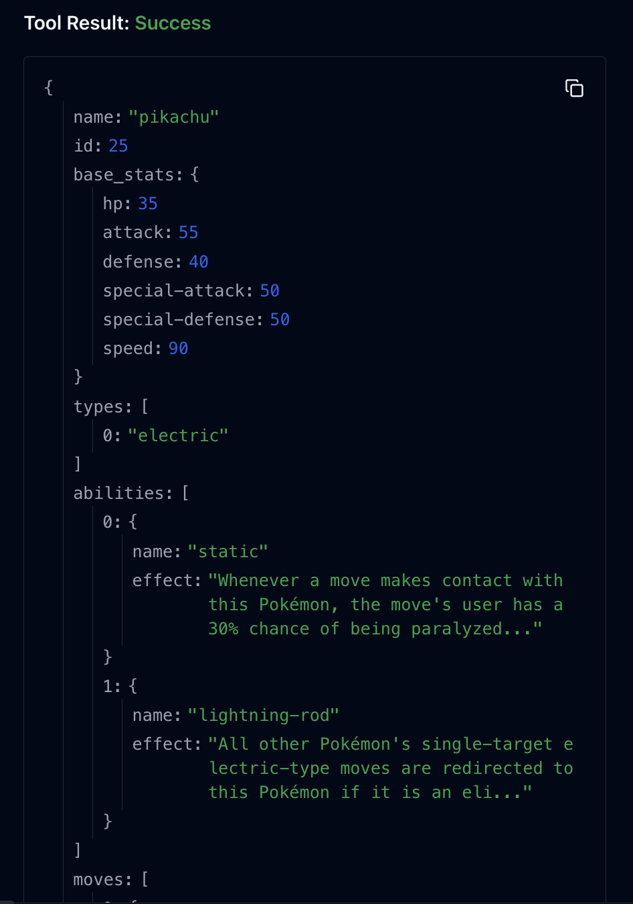

# PokeMCP

PokeMCP is an MCP (Modular Command Platform) server that provides detailed Pokémon information by integrating with the [PokeAPI](https://pokeapi.co/). It exposes a tool to fetch comprehensive data about any Pokémon, including base stats, types, abilities (with effects), moves (with effects), and evolution chain.

## Features
- Fetches Pokémon base stats, types, and abilities (with effect descriptions)
- Retrieves up to 10 moves per Pokémon, including move effects
- Provides the full evolution chain for a given Pokémon
- Handles errors gracefully and returns informative error messages

## Requirements
- Python 3.8+
- [httpx](https://www.python-httpx.org/) (for async HTTP requests)
- [mcp.server.fastmcp](https://github.com/microsoft/mcp) (for MCP server framework)

## Installation
1. Clone this repository:
   ```bash
   git clone <your-repo-url>
   cd poke-mcp
   ```
2. Install dependencies using [uv](https://github.com/astral-sh/uv):
   ```bash
   uv pip install -r requirements.txt
   # Or install httpx and mcp.server.fastmcp individually if requirements.txt is not present
   uv pip install httpx
   # And install mcp.server.fastmcp as required by your environment
   ```

## Usage
Run the server using uv (ensure you have the required MCP infrastructure):
```bash
uv run mcp dev server.py
```

## API

### Tool: `get_pokemon_info`
Fetches detailed information about a Pokémon.

#### Arguments
- `pokemon_name` (str): The name of the Pokémon (case-insensitive)

#### Returns
A dictionary with the following structure:
```json
{
  "name": "pikachu",
  "id": 25,
  "base_stats": {
    "hp": 35,
    "attack": 55,
    ...
  },
  "types": ["electric"],
  "abilities": [
    {"name": "static", "effect": "May paralyze on contact."},
    ...
  ],
  "moves": [
    {"name": "thunder-shock", "effect": "Has a 10% chance to paralyze the target."},
    ...
  ],
  "evolution_chain": ["pichu", "pikachu", "raichu"]
}
```

#### Error Handling
If the Pokémon is not found or there is a network error, the response will include an `error` key with a descriptive message.

### Visual Example: Pokémon Info


### Tool: `simulate_battle`
Simulates a Pokémon battle between two Pokémon using core mechanics (stats, type, and status effects).

#### Arguments
- `pokemon1` (str): Name of the first Pokémon (case-insensitive)
- `pokemon2` (str): Name of the second Pokémon (case-insensitive)

#### Returns
A dictionary with the following structure:
```json
{
  "pokemon1": "pikachu",
  "pokemon2": "bulbasaur",
  "battle_log": [
    "Turn 1:",
    "pikachu uses thunder-shock and deals 12 damage!",
    "bulbasaur is now paralysis!",
    "bulbasaur: ",
    "bulbasaur uses tackle and deals 10 damage!",
    "pikachu: ",
    ...
    "Winner: pikachu!"
  ],
  "winner": "pikachu"
}
```

#### Error Handling
If either Pokémon is not found or there is a network error, the response will include an `error` key with a descriptive message.

#### Visual Example: Simulate Battle


## License
This project uses the [PokeAPI](https://pokeapi.co/) and is intended for educational and non-commercial use.